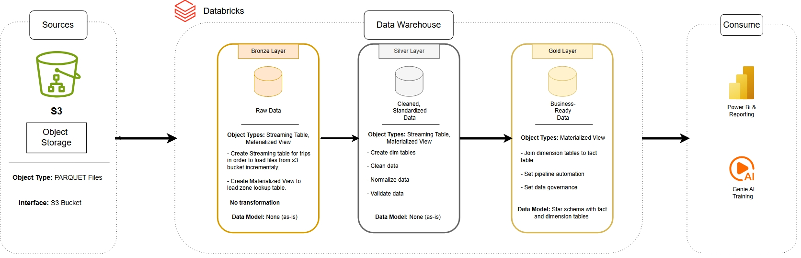

#  🚕 Taxi_Ride_Data_Warehouse_2025

## 📌 Overview
This project builds an end-to-end **data warehouse (lakehouse)** for analyzing taxi trip data from the NYC Taxi and Limousine Commission (TLC) using Spark Declarative Pipelines (SDP) in Databricks.

The pipeline transforms raw trip data into **analytics-ready tables and dashboards**, following the **Medallion Architecture (Bronze → Silver → Gold)**.

---

## 🎯 Objectives
- Build a scalable ETL pipeline using PySpark and SDP
- Clean and validate raw taxi data  
- Design a **star schema data warehouse**  
- Generate business insights through SQL and dashboards  
- Implement **data quality monitoring (bonus feature)**  

---

## 🏗️ Architecture
The data architecture for this project follows Medallion Architecture Bronze, Silver, and Gold layers:

